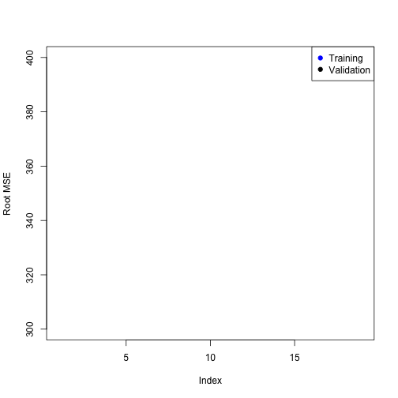
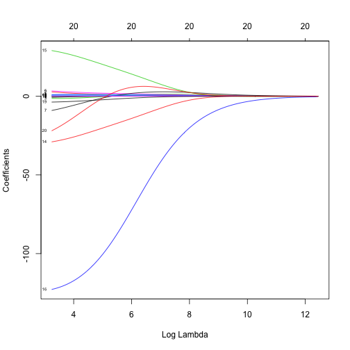
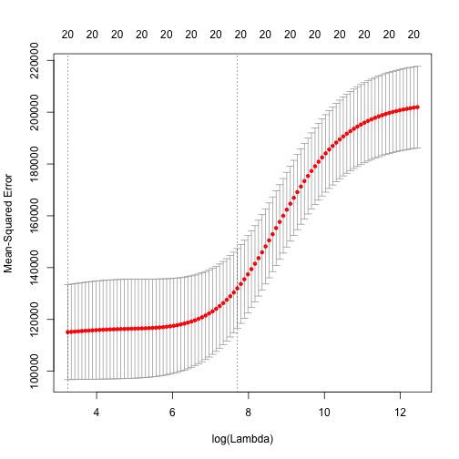
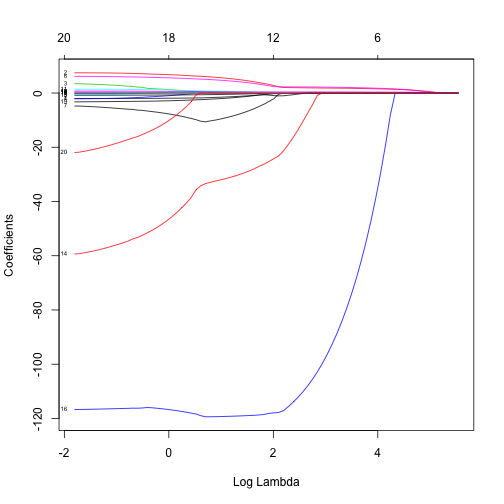
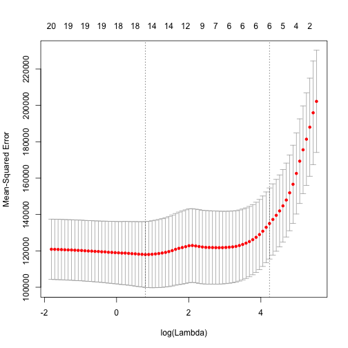

Model Selection
================

This is an R Markdown document. Markdown is a simple formatting syntax for authoring web pages,
and a very nice way of distributing an analysis. It has some very simple syntax rules.


```r
library(ISLR)
summary(Hitters)
```

```
##      AtBat          Hits         HmRun           Runs      
##  Min.   : 16   Min.   :  1   Min.   : 0.0   Min.   :  0.0  
##  1st Qu.:255   1st Qu.: 64   1st Qu.: 4.0   1st Qu.: 30.2  
##  Median :380   Median : 96   Median : 8.0   Median : 48.0  
##  Mean   :381   Mean   :101   Mean   :10.8   Mean   : 50.9  
##  3rd Qu.:512   3rd Qu.:137   3rd Qu.:16.0   3rd Qu.: 69.0  
##  Max.   :687   Max.   :238   Max.   :40.0   Max.   :130.0  
##                                                            
##       RBI            Walks           Years           CAtBat     
##  Min.   :  0.0   Min.   :  0.0   Min.   : 1.00   Min.   :   19  
##  1st Qu.: 28.0   1st Qu.: 22.0   1st Qu.: 4.00   1st Qu.:  817  
##  Median : 44.0   Median : 35.0   Median : 6.00   Median : 1928  
##  Mean   : 48.0   Mean   : 38.7   Mean   : 7.44   Mean   : 2649  
##  3rd Qu.: 64.8   3rd Qu.: 53.0   3rd Qu.:11.00   3rd Qu.: 3924  
##  Max.   :121.0   Max.   :105.0   Max.   :24.00   Max.   :14053  
##                                                                 
##      CHits          CHmRun          CRuns           CRBI       
##  Min.   :   4   Min.   :  0.0   Min.   :   1   Min.   :   0.0  
##  1st Qu.: 209   1st Qu.: 14.0   1st Qu.: 100   1st Qu.:  88.8  
##  Median : 508   Median : 37.5   Median : 247   Median : 220.5  
##  Mean   : 718   Mean   : 69.5   Mean   : 359   Mean   : 330.1  
##  3rd Qu.:1059   3rd Qu.: 90.0   3rd Qu.: 526   3rd Qu.: 426.2  
##  Max.   :4256   Max.   :548.0   Max.   :2165   Max.   :1659.0  
##                                                                
##      CWalks       League  Division    PutOuts        Assists     
##  Min.   :   0.0   A:175   E:157    Min.   :   0   Min.   :  0.0  
##  1st Qu.:  67.2   N:147   W:165    1st Qu.: 109   1st Qu.:  7.0  
##  Median : 170.5                    Median : 212   Median : 39.5  
##  Mean   : 260.2                    Mean   : 289   Mean   :106.9  
##  3rd Qu.: 339.2                    3rd Qu.: 325   3rd Qu.:166.0  
##  Max.   :1566.0                    Max.   :1378   Max.   :492.0  
##                                                                  
##      Errors          Salary       NewLeague
##  Min.   : 0.00   Min.   :  67.5   A:176    
##  1st Qu.: 3.00   1st Qu.: 190.0   N:146    
##  Median : 6.00   Median : 425.0            
##  Mean   : 8.04   Mean   : 535.9            
##  3rd Qu.:11.00   3rd Qu.: 750.0            
##  Max.   :32.00   Max.   :2460.0            
##                  NA's   :59
```

There are some missing values here, so before we proceed we will remove them:


```r
Hitters = na.omit(Hitters)
with(Hitters, sum(is.na(Salary)))
```

```
## [1] 0
```


Best Subset regression
------------------------
We will now use the package `leaps` to evaluate all the best-subset models.

```r
library(leaps)
```

```
## Error: there is no package called 'leaps'
```

```r
regfit.full = regsubsets(Salary ~ ., data = Hitters)
```

```
## Error: could not find function "regsubsets"
```

```r
summary(regfit.full)
```

```
## Error: object 'regfit.full' not found
```

It gives by default best-subsets up to size 8; lets increase that to 19, i.e. all the variables

```r
regfit.full = regsubsets(Salary ~ ., data = Hitters, nvmax = 19)
```

```
## Error: could not find function "regsubsets"
```

```r
reg.summary = summary(regfit.full)
```

```
## Error: object 'regfit.full' not found
```

```r
names(reg.summary)
```

```
## Error: object 'reg.summary' not found
```

```r
plot(reg.summary$cp, xlab = "Number of Variables", ylab = "Cp")
```

```
## Error: object 'reg.summary' not found
```

```r
which.min(reg.summary$cp)
```

```
## Error: object 'reg.summary' not found
```

```r
points(10, reg.summary$cp[10], pch = 20, col = "red")
```

```
## Error: object 'reg.summary' not found
```

There is a plot method for the `regsubsets`  object

```r
plot(regfit.full, scale = "Cp")
```

```
## Error: object 'regfit.full' not found
```

```r
coef(regfit.full, 10)
```

```
## Error: object 'regfit.full' not found
```


Forward Stepwise Selection
--------------------------
Here we use the `regsubsets` function but specify the `method="forward" option:

```r
regfit.fwd = regsubsets(Salary ~ ., data = Hitters, nvmax = 19, method = "forward")
```

```
## Error: could not find function "regsubsets"
```

```r
summary(regfit.fwd)
```

```
## Error: object 'regfit.fwd' not found
```

```r
plot(regfit.fwd, scale = "Cp")
```

```
## Error: object 'regfit.fwd' not found
```


Model Selection Using a Validation Set
---------------------------------------
Lets make a training and validation set, so that we can choose a good subset model.
We will do it using a slightly different approach from what was done in the the book.

```r
dim(Hitters)
```

```
## [1] 263  20
```

```r
set.seed(1)
train = sample(seq(263), 180, replace = FALSE)
train
```

```
##   [1]  70  98 150 237  53 232 243 170 161  16 259  45 173  97 192 124 178
##  [18] 245  94 190 228  52 158  31  64  92   4  91 205  80 113 140 115  43
##  [35] 244 153 181  25 163  93 184 144 174 122 117 251   6 104 241 149 102
##  [52] 183 224 242  15  21  66 107 136  83 186  60 211  67 130 210  95 151
##  [69]  17 256 207 162 200 239 236 168 249  73 222 177 234 199 203  59 235
##  [86]  37 126  22 230 226  42  11 110 214 132 134  77  69 188 100 206  58
## [103]  44 159 101  34 208  75 185 201 261 112  54  65  23   2 106 254 257
## [120] 154 142  71 166 221 105  63 143  29 240 212 167 172   5  84 120 133
## [137]  72 191 248 138 182  74 179 135  87 196 157 119  13  99 263 125 247
## [154]  50  55  20  57   8  30 194 139 238  46  78  88  41   7  33 141  32
## [171] 180 164 213  36 215  79 225 229 198  76
```

```r
regfit.fwd = regsubsets(Salary ~ ., data = Hitters[train, ], nvmax = 19, method = "forward")
```

```
## Error: could not find function "regsubsets"
```

Now we will make predictions on the observations not used for training. We know there are 19 models, so we set up some vectors to record the errors. We have to do a bit of work here, because there is no predict method for `regsubsets`.

```r
val.errors = rep(NA, 19)
x.test = model.matrix(Salary ~ ., data = Hitters[-train, ])  # notice the -index!
for (i in 1:19) {
    coefi = coef(regfit.fwd, id = i)
    pred = x.test[, names(coefi)] %*% coefi
    val.errors[i] = mean((Hitters$Salary[-train] - pred)^2)
}
```

```
## Error: object 'regfit.fwd' not found
```

```r
plot(sqrt(val.errors), ylab = "Root MSE", ylim = c(300, 400), pch = 19, type = "b")
points(sqrt(regfit.fwd$rss[-1]/180), col = "blue", pch = 19, type = "b")
```

```
## Error: object 'regfit.fwd' not found
```

```r
legend("topright", legend = c("Training", "Validation"), col = c("blue", "black"), 
    pch = 19)
```

 

As we expect, the training error goes down monotonically as the model gets bigger, but not so 
for the validation error.

This was a little tedious - not having a predict method for `regsubsets`. So we will write one!

```r
predict.regsubsets = function(object, newdata, id, ...) {
    form = as.formula(object$call[[2]])
    mat = model.matrix(form, newdata)
    coefi = coef(object, id = id)
    mat[, names(coefi)] %*% coefi
}
```


Model Selection by Cross-Validation
-----------------------------------
We will do 10-fold cross-validation. Its really easy!

```r
set.seed(11)
folds = sample(rep(1:10, length = nrow(Hitters)))
folds
```

```
##   [1]  3  1  4  4  7  7  3  5  5  2  5  2  8  3  3  3  9  2  9  8 10  5  8
##  [24]  5  5  5  5 10 10  4  4  7  6  7  7  7  3  4  8  3  6  8 10  4  3  9
##  [47]  9  3  4  9  8  7 10  6 10  3  6  9  4  2  8  2  5  6 10  7  2  8  8
##  [70]  1  3  6  2  5  8  1  1  2  8  1 10  1  2  3  6  6  5  8  8 10  4  2
##  [93]  6  1  7  4  8  3  7  8  7  1 10  1  6  2  9 10  1  7  7  4  7  4 10
## [116]  3  6 10  6  6  9  8 10  6  7  9  6  7  1 10  2  2  5  9  9  6  1  1
## [139]  2  9  4 10  5  3  7  7 10 10  9  3  3  7  3  1  4  6  6 10  4  9  9
## [162]  1  3  6  8 10  8  5  4  5  6  2  9 10  3  7  7  6  6  2  3  2  4  4
## [185]  4  4  8  2  3  5  9  9 10  2  1  3  9  6  7  3  1  9  4 10 10  8  8
## [208]  8  2  5  9  8 10  5  8  2  4  1  4  4  5  5  2  1  9  5  2  9  9  5
## [231]  3  2  1  9  1  7  2  5  8  1  1  7  6  6  4  5 10  5  7  4  8  6  9
## [254]  1  2  5  7  1  3  1  3  1  2
```

```r
table(folds)
```

```
## folds
##  1  2  3  4  5  6  7  8  9 10 
## 27 27 27 26 26 26 26 26 26 26
```

```r
cv.errors = matrix(NA, 10, 19)
for (k in 1:10) {
    best.fit = regsubsets(Salary ~ ., data = Hitters[folds != k, ], nvmax = 19, 
        method = "forward")
    for (i in 1:19) {
        pred = predict(best.fit, Hitters[folds == k, ], id = i)
        cv.errors[k, i] = mean((Hitters$Salary[folds == k] - pred)^2)
    }
}
```

```
## Error: could not find function "regsubsets"
```

```r
rmse.cv = sqrt(apply(cv.errors, 2, mean))
plot(rmse.cv, pch = 19, type = "b")
```

```
## Warning: no non-missing arguments to min; returning Inf
## Warning: no non-missing arguments to max; returning -Inf
```

```
## Error: need finite 'ylim' values
```

 


Ridge Regression and the Lasso
-------------------------------
We will use the package `glmnet`, which does not use the model formula language, so we will set up an `x` and `y`.

```r
library(glmnet)
```

```
## Loading required package: Matrix
## Loaded glmnet 1.9-5
```

```r
x = model.matrix(Salary ~ . - 1, data = Hitters)
y = Hitters$Salary
```

First we will fit a ridge-regression model. This is achieved by calling `glmnet` with `alpha=0` (see the helpfile). There is also a `cv.glmnet` function which will do the cross-validation for us. 

```r
fit.ridge = glmnet(x, y, alpha = 0)
plot(fit.ridge, xvar = "lambda", label = TRUE)
```

 

```r
cv.ridge = cv.glmnet(x, y, alpha = 0)
plot(cv.ridge)
```

 

Now we fit a lasso model; for this we use the default `alpha=1`

```r
fit.lasso = glmnet(x, y)
plot(fit.lasso, xvar = "lambda", label = TRUE)
```

 

```r
cv.lasso = cv.glmnet(x, y)
plot(cv.lasso)
```

 

```r
coef(cv.lasso)
```

```
## 21 x 1 sparse Matrix of class "dgCMatrix"
##                     1
## (Intercept) 127.95695
## AtBat         .      
## Hits          1.42343
## HmRun         .      
## Runs          .      
## RBI           .      
## Walks         1.58214
## Years         .      
## CAtBat        .      
## CHits         .      
## CHmRun        .      
## CRuns         0.16028
## CRBI          0.33668
## CWalks        .      
## LeagueA       .      
## LeagueN       .      
## DivisionW    -8.06171
## PutOuts       0.08394
## Assists       .      
## Errors        .      
## NewLeagueN    .
```


 Suppose we want to use our earlier train/validation division to select the `lambda` for the lasso.
 This is easy to do.

```r
lasso.tr = glmnet(x[train, ], y[train])
lasso.tr
```

```
## 
## Call:  glmnet(x = x[train, ], y = y[train]) 
## 
##       Df   %Dev   Lambda
##  [1,]  0 0.0000 246.0000
##  [2,]  1 0.0501 225.0000
##  [3,]  1 0.0917 205.0000
##  [4,]  2 0.1380 186.0000
##  [5,]  2 0.1800 170.0000
##  [6,]  3 0.2160 155.0000
##  [7,]  3 0.2470 141.0000
##  [8,]  3 0.2730 128.0000
##  [9,]  4 0.3000 117.0000
## [10,]  4 0.3240 107.0000
## [11,]  4 0.3430  97.2000
## [12,]  4 0.3590  88.6000
## [13,]  5 0.3740  80.7000
## [14,]  5 0.3890  73.5000
## [15,]  5 0.4020  67.0000
## [16,]  5 0.4130  61.0000
## [17,]  5 0.4210  55.6000
## [18,]  5 0.4290  50.7000
## [19,]  5 0.4350  46.2000
## [20,]  5 0.4400  42.1000
## [21,]  5 0.4440  38.3000
## [22,]  5 0.4480  34.9000
## [23,]  6 0.4510  31.8000
## [24,]  7 0.4550  29.0000
## [25,]  7 0.4580  26.4000
## [26,]  7 0.4600  24.1000
## [27,]  8 0.4620  21.9000
## [28,]  8 0.4640  20.0000
## [29,]  8 0.4650  18.2000
## [30,]  8 0.4660  16.6000
## [31,]  8 0.4670  15.1000
## [32,]  8 0.4680  13.8000
## [33,]  9 0.4710  12.6000
## [34,]  9 0.4740  11.4000
## [35,]  9 0.4760  10.4000
## [36,] 10 0.4810   9.5000
## [37,]  9 0.4850   8.6500
## [38,] 10 0.4880   7.8800
## [39,] 10 0.4940   7.1800
## [40,] 11 0.4990   6.5400
## [41,] 12 0.5050   5.9600
## [42,] 12 0.5100   5.4300
## [43,] 13 0.5150   4.9500
## [44,] 13 0.5180   4.5100
## [45,] 13 0.5220   4.1100
## [46,] 14 0.5240   3.7500
## [47,] 14 0.5270   3.4100
## [48,] 15 0.5290   3.1100
## [49,] 15 0.5300   2.8300
## [50,] 15 0.5320   2.5800
## [51,] 16 0.5330   2.3500
## [52,] 17 0.5340   2.1400
## [53,] 18 0.5360   1.9500
## [54,] 18 0.5380   1.7800
## [55,] 18 0.5390   1.6200
## [56,] 18 0.5400   1.4800
## [57,] 18 0.5410   1.3500
## [58,] 18 0.5420   1.2300
## [59,] 18 0.5420   1.1200
## [60,] 18 0.5430   1.0200
## [61,] 18 0.5430   0.9280
## [62,] 18 0.5440   0.8450
## [63,] 18 0.5440   0.7700
## [64,] 19 0.5440   0.7020
## [65,] 19 0.5440   0.6390
## [66,] 19 0.5450   0.5830
## [67,] 19 0.5450   0.5310
## [68,] 19 0.5450   0.4840
## [69,] 20 0.5450   0.4410
## [70,] 20 0.5450   0.4020
## [71,] 20 0.5450   0.3660
## [72,] 20 0.5450   0.3330
## [73,] 20 0.5460   0.3040
## [74,] 20 0.5460   0.2770
## [75,] 20 0.5460   0.2520
## [76,] 20 0.5460   0.2300
## [77,] 20 0.5460   0.2090
## [78,] 20 0.5460   0.1910
## [79,] 20 0.5460   0.1740
## [80,] 20 0.5460   0.1580
## [81,] 20 0.5460   0.1440
## [82,] 20 0.5460   0.1320
## [83,] 20 0.5460   0.1200
## [84,] 19 0.5460   0.1090
## [85,] 19 0.5460   0.0995
## [86,] 19 0.5460   0.0906
## [87,] 19 0.5460   0.0826
## [88,] 20 0.5460   0.0752
## [89,] 20 0.5460   0.0686
```

```r
pred = predict(lasso.tr, x[-train, ])
dim(pred)
```

```
## [1] 83 89
```

```r
rmse = sqrt(apply((y[-train] - pred)^2, 2, mean))
plot(log(lasso.tr$lambda), rmse, type = "b", xlab = "Log(lambda)")
```

 

```r
lam.best = lasso.tr$lambda[order(rmse)[1]]
lam.best
```

```
## [1] 19.99
```

```r
coef(lasso.tr, s = lam.best)
```

```
## 21 x 1 sparse Matrix of class "dgCMatrix"
##                     1
## (Intercept)  107.9417
## AtBat          .     
## Hits           0.1591
## HmRun          .     
## Runs           .     
## RBI            1.7340
## Walks          3.4657
## Years          .     
## CAtBat         .     
## CHits          .     
## CHmRun         .     
## CRuns          0.5387
## CRBI           .     
## CWalks         .     
## LeagueA      -30.0493
## LeagueN        .     
## DivisionW   -113.8317
## PutOuts        0.2915
## Assists        .     
## Errors         .     
## NewLeagueN     2.0368
```

